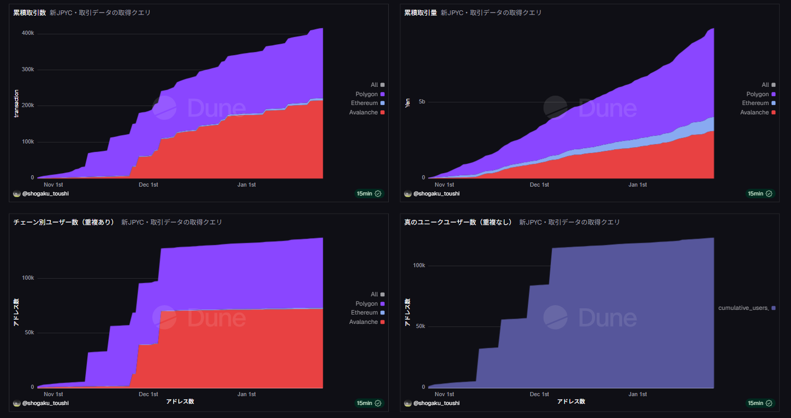

# Dune Analytics - Blockchain Data Analysis

On-chain data analysis using [Dune Analytics](https://dune.com). This repository contains SQL queries and analysis documentation for blockchain projects.

## Dashboards

### JPYC Stablecoin Analysis

Analysis of **JPYC** - Japan's first regulated stablecoin launched on October 27, 2025. Tracks issuance, redemption, and circulating supply across multiple chains.

**[View Dashboard on Dune](https://dune.com/shogaku_toushi/jpyc-date)**

#### What This Dashboard Tracks

| Metric | Description |
|--------|-------------|
| Issuance (Billion JPY) | Amount sent from JPYC corporate wallets to customers |
| Redemption (Billion JPY) | Amount returned from customers to JPYC corporate wallets |
| Circulating Supply (Billion JPY) | Issuance - Redemption |
| Unique Users | New user count per chain and globally (daily query) |
| Chains | Ethereum, Polygon, Avalanche |

#### Technical Highlights

- **2 queries**: Monthly (8 CTEs) + Daily (19 CTEs)
- **Multi-chain analysis** across Ethereum, Polygon, and Avalanche
- **Dynamic wallet detection** - JPYC corporate wallets identified via Mint event recipients
- **Issuance/Redemption classification** - each Transfer categorized as issuance, redemption, or regular transfer
- **Window functions** (`SUM OVER`, `PARTITION BY`) for cumulative calculations
- **Cross-chain user deduplication** in daily query - same address on multiple chains counted once

#### Files

| File | Description |
|------|-------------|
| [queries/jpyc_monthly.sql](queries/jpyc_monthly.sql) | Monthly aggregation query (8 CTEs) |
| [queries/jpyc_daily.sql](queries/jpyc_daily.sql) | Daily aggregation query (19 CTEs) |
| [docs/jpyc_analysis_blog.md](docs/jpyc_analysis_blog.md) | Detailed explanation (Japanese) |

#### Dune Query Links

- Monthly: https://dune.com/queries/6603840
- Daily: https://dune.com/queries/6593053

---

## About

This repository showcases blockchain data analysis skills using SQL on Dune Analytics.

**Tools Used:**
- Dune Analytics (SQL, DuneSQL/Trino)
- On-chain data from Ethereum, Polygon, Avalanche

---

*Powered by [Dune Analytics](https://dune.com)*
