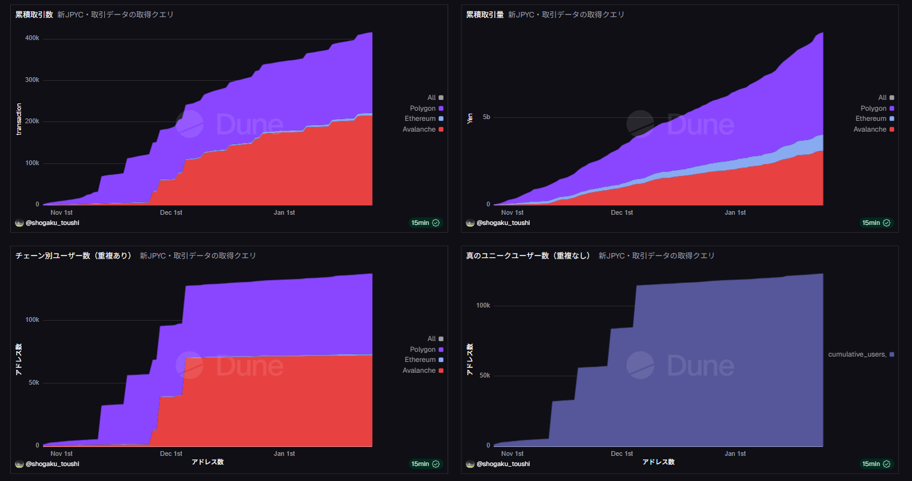

# Dune Analytics - JPYC Stablecoin Tracker

On-chain data analysis of **JPYC** (Japan's yen-pegged stablecoin, launched October 27, 2025) using [Dune Analytics](https://dune.com). Data is automatically fetched weekly via GitHub Actions.

**[View Dashboard on Dune](https://dune.com/shogaku_toushi/jpyc-date)** · **[Data on Hugging Face](https://huggingface.co/datasets/yasumorishima/jpyc-data)**



## Latest Data (Cumulative, Billion JPY)

<!-- LATEST_DATA_START -->
| Month | Chain | Issuance | Redemption | Circulating |
|-------|-------|----------|------------|-------------|
| 2026-07 | Avalanche | 2.74 | 0 | 2.74 |
| 2026-07 | Ethereum | 7.28 | 0 | 7.28 |
| 2026-07 | Polygon | 28.12 | 0 | 28.12 |
| 2026-06 | Avalanche | 2.64 | 0 | 2.64 |
| 2026-06 | Ethereum | 6.91 | 0 | 6.91 |
| 2026-06 | Polygon | 26.86 | 0 | 26.86 |
| 2026-05 | Avalanche | 2.37 | 0 | 2.37 |
| 2026-05 | Ethereum | 5.58 | 0 | 5.58 |
| 2026-05 | Polygon | 22.51 | 0 | 22.51 |
| 2026-04 | Avalanche | 2.13 | 0 | 2.13 |
| 2026-04 | Ethereum | 4.03 | 0 | 4.03 |
| 2026-04 | Polygon | 17.71 | 0 | 17.71 |
| 2026-03 | Avalanche | 1.87 | 0 | 1.87 |
| 2026-03 | Ethereum | 3.04 | 0 | 3.04 |
| 2026-03 | Polygon | 14.14 | 0 | 14.14 |
| 2026-02 | Avalanche | 1.64 | 0 | 1.64 |
| 2026-02 | Ethereum | 2.32 | 0 | 2.32 |
| 2026-02 | Polygon | 10.66 | 0 | 10.66 |
| 2026-01 | Avalanche | 1.49 | 0 | 1.49 |
| 2026-01 | Ethereum | 1.67 | 0 | 1.67 |
| 2026-01 | Polygon | 7.43 | 0 | 7.43 |
| 2025-12 | Avalanche | 1.22 | 0 | 1.22 |
| 2025-12 | Ethereum | 0.91 | 0 | 0.91 |
| 2025-12 | Polygon | 4.4 | 0 | 4.4 |
| 2025-11 | Avalanche | 0.72 | 0 | 0.72 |
| 2025-11 | Ethereum | 0.49 | 0 | 0.49 |
| 2025-11 | Polygon | 2.53 | 0 | 2.53 |
| 2025-10 | Avalanche | 0.25 | 0 | 0.25 |
| 2025-10 | Ethereum | 0.27 | 0 | 0.27 |
| 2025-10 | Polygon | 0.46 | 0 | 0.46 |

**Global Total (2026-07)**: Issuance 38.14 B JPY / Redemption 0 B JPY / Circulating 38.14 B JPY

**Latest date**: 2026-07-06 / **Total unique users**: 142,019

*Last updated: 2026-08-24T01:06:59Z*
<!-- LATEST_DATA_END -->

## What This Tracks

| Metric | Description |
|--------|-------------|
| Issuance (Billion JPY) | Amount sent from JPYC corporate wallets to customers |
| Redemption (Billion JPY) | Amount returned from customers to JPYC corporate wallets |
| Circulating Supply (Billion JPY) | Issuance - Redemption |
| Unique Users | New user count per chain and globally (daily query) |
| Chains | Ethereum, Polygon, Avalanche |

## Technical Highlights

- **2 queries**: Monthly (8 CTEs) + Daily (19 CTEs)
- **Multi-chain analysis** across Ethereum, Polygon, and Avalanche
- **Dynamic wallet detection** - JPYC corporate wallets identified via Mint event recipients
- **Mint/Burn exclusion** - Mint (`from = 0x0`) and Burn (`to = 0x0`) events filtered out to prevent misclassification
- **Internal transfer handling** - Transfers between JPYC corporate wallets classified as `internal` and excluded from metrics
- **Window functions** (`SUM OVER`, `PARTITION BY`) for cumulative calculations
- **Cross-chain user deduplication** in daily query - same address on multiple chains counted once

## Automation

Data is automatically fetched every Monday 09:00 JST via GitHub Actions using the [Dune API](https://docs.dune.com/api-reference/overview/introduction). CSV data is committed to this repo and mirrored to a [Hugging Face dataset](https://huggingface.co/datasets/yasumorishima/jpyc-data) as the canonical cloud store.

```
GitHub Actions (cron) → Dune API (get_latest_result, run_query fallback) → CSV + README update → git push + Hugging Face mirror
```

### Setup

1. Generate an API key at [Dune Settings](https://dune.com/settings/api)
2. Add it as a repository secret: `gh secret set DUNE_API_KEY --body "your-key"`
3. (Optional) Add a Hugging Face write token to mirror data to a dataset: `gh secret set HF_TOKEN`
4. Push to enable the workflow (or trigger manually via Actions tab)

## Files

| File | Description |
|------|-------------|
| [queries/jpyc_monthly.sql](queries/jpyc_monthly.sql) | Monthly aggregation query v1 |
| [queries/jpyc_monthly_v2.sql](queries/jpyc_monthly_v2.sql) | Monthly aggregation query v2 (current) |
| [queries/jpyc_daily.sql](queries/jpyc_daily.sql) | Daily aggregation query v1 |
| [queries/jpyc_daily_v2.sql](queries/jpyc_daily_v2.sql) | Daily aggregation query v2 (current) |
| [scripts/fetch_jpyc.py](scripts/fetch_jpyc.py) | Dune API fetch script |
| [data/](data/) | Auto-updated CSV data |
| [docs/jpyc_analysis_blog.md](docs/jpyc_analysis_blog.md) | Detailed explanation (Japanese) |

## Dune Query Links

- Monthly: https://dune.com/queries/6603840
- Daily: https://dune.com/queries/6593053

## v1 → v2 Changelog

| Fix | Detail |
|-----|--------|
| Mint/Burn exclusion | Mint events (`0x0 → JPYC wallet`) were misclassified as redemption; Burn events as issuance. Fixed by filtering `0x0` address. |
| Internal transfers | Transfers where both `from` and `to` are JPYC wallets now classified as `internal` and excluded. |
| Activity filter | Monthly query activity filter aligned with daily query (all non-internal types). |

---

*Powered by [Dune Analytics](https://dune.com)*
